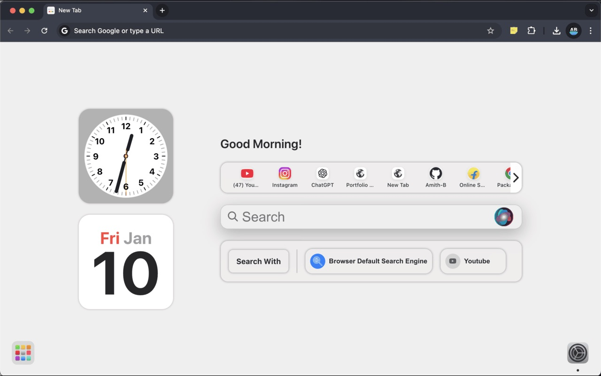

# This is a simple new tab (browser's home page) inspired by Mac OS design., created using React

## Install Packages with: `yarn install`

## To run the project: `yarn start`

## To build: `yarn build`

#### Once the build is generated in build folder, this folder can be used to load the extension in `chrome://extensions/` with developer mode.

## Chrome extension link: [https://chromewebstore.google.com/detail/noteit/hjcoohfjnikkaaglpndoaeacjjdfbjcd](https://chromewebstore.google.com/detail/mac-new-tab/mohppegbiigoahehdihbgmabkflajklj?authuser=0&hl=en)
