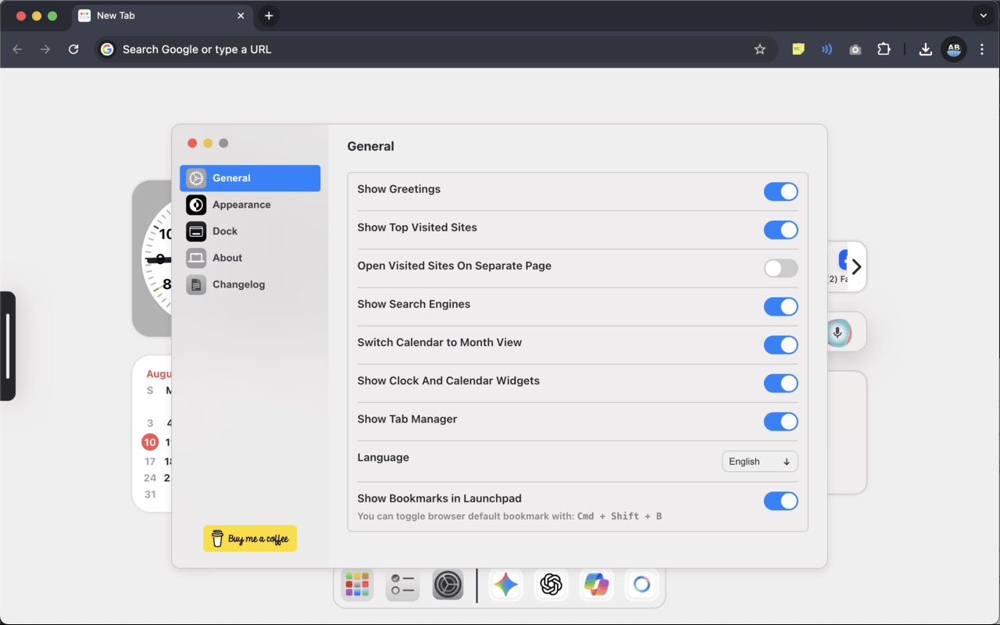

# macOS Inspired New Tab

This is a simple new tab (browser's home page) inspired by macOS design, created using React.

<p align="center">
   
  
</p>
<p align="center">
   
  
</p>
<p align="center">
   
  
</p>

<p align="center">
   
</p>

## 🚀 Features

### 🌟 Elegant Widgets

- Display an **analog clock**, **date**, and **personalized greetings**—just like macOS.

### 🔍 Powerful Search

- Search effortlessly with an intuitive input bar.
- Choose between:
  - Your **browser’s default search engine**
  - **YouTube**
  - **ChatGPT**
  - **Spotify**
- If a URL is detected, it directly redirects instead of searching (browser search only).

### ⚡ Quick Access to Favorites

- Navigate to your most-visited sites quickly.
- Customize whether links open in the same tab or a new one.

### 📚 Bookmark Manager (New!)

- Browse and search through all your saved bookmarks in a clean, macOS-inspired interface.
- Quickly open any bookmark with a single click.
- Organized in a launchpad for easy access without leaving the new tab.

### 🎨 Customizable Themes & Wallpapers

- Toggle between **dark mode, light mode, or system mode**.
- Choose theme colors.
- Set a **custom wallpaper** or pick from a **stunning collection**.
- **Dynamic Wallpapers**: Choose from **animated themes** including Nature, Sci-Fi, and Abstract styles.

### 📅 Toggle Calendar Views

- Switch between **month view** and **date view**.

### 🗣️ Voice Search

- Activate voice search with a Siri-like button for hands-free browsing.

### 📱 Launchpad & Dock

- Access favorite links quickly with a customizable **dock bar** and **Launchpad overlay**.

### 📝 Daily To-Do List

Stay on top of your tasks with a simple, built-in **to-do list**. Easily add and manage daily items directly from your **new tab**.

### 🗒️ Sticky Notes

- Create colorful, draggable **sticky notes** directly on your new tab page
- **Drag and drop** notes anywhere on the screen for perfect organization
- **Auto-save** - all notes persist across browser sessions
- **Quick access** - create new notes instantly from the dock
- **Editable content** - click to type and edit your notes on the fly
- Perfect for quick reminders, ideas, and temporary notes

### 🗂️ Seamless Tab Management

- Stay in control of your browser with a built-in Tab Manager—beautifully integrated into the side panel
- Instantly search through all open tabs, Switch to any tab with a click, Close tabs directly from the list
- Easily toggle the panel with a subtle notch on the screen’s edge

### 🗓️ Google Calendar Events

- Seamlessly integrates with Google Calendar using Google Sign-In.
- Displays your upcoming events for the next 30 days directly on the new tab page.
- Shows event title, time, and source calendar with a clean macOS-style widget.
- Clicking an event opens it instantly in Google Calendar.
- All authentication and data access happen securely through Google APIs — no user data is stored or shared externally.
- Optionally toggle this widget on or off from the settings panel for a clutter-free experience.

### 🍅 Focus Studio (New!)

- Stay productive with a built-in **Pomodoro-style timer**.
- **Ambient Sounds**: Mask distractions with Brown, Pink, White, Violet, and Blue noise generators.
- **Task Integration**: Link your timer session to a specific task from your To-Do list.
- **Visual & Audio Alerts**: Get notified with a gentle chime and notification when your session is complete.
- Customize your focus duration to match your workflow.

### 💾 Backup & Restore

- Never lose your setup! Easily **export** your settings, to-do lists, sticky notes, and custom wallpapers to a JSON file.
- **Import** your data to restore your dashboard on a new device or browser instance.

### 🌍 Multi-Language Support

- Supports **15+ languages**, including English, Kannada, Hindi, Spanish, French, Chinese, Japanese, Korean, and more.

## 🛠 Installation & Running Locally

### Install Packages

```sh
yarn install
```

### To Run the Project

```sh
yarn start
```

### To Build

```sh
yarn build
```

#### Once the build is generated in the `build` folder, this folder can be used to load the extension in `chrome://extensions/` with Developer Mode enabled.

## Chrome Extension Link

[Install from Chrome Web Store](https://chromewebstore.google.com/detail/mac-new-tab/mohppegbiigoahehdihbgmabkflajklj?authuser=0&hl=en)

---

Enjoy the elegance of macOS design right in your browser! ✨

---

**[Privacy Policy](https://amith-b.github.io/macnewtab/privacy.html)**  
© 2025 macnewtab
