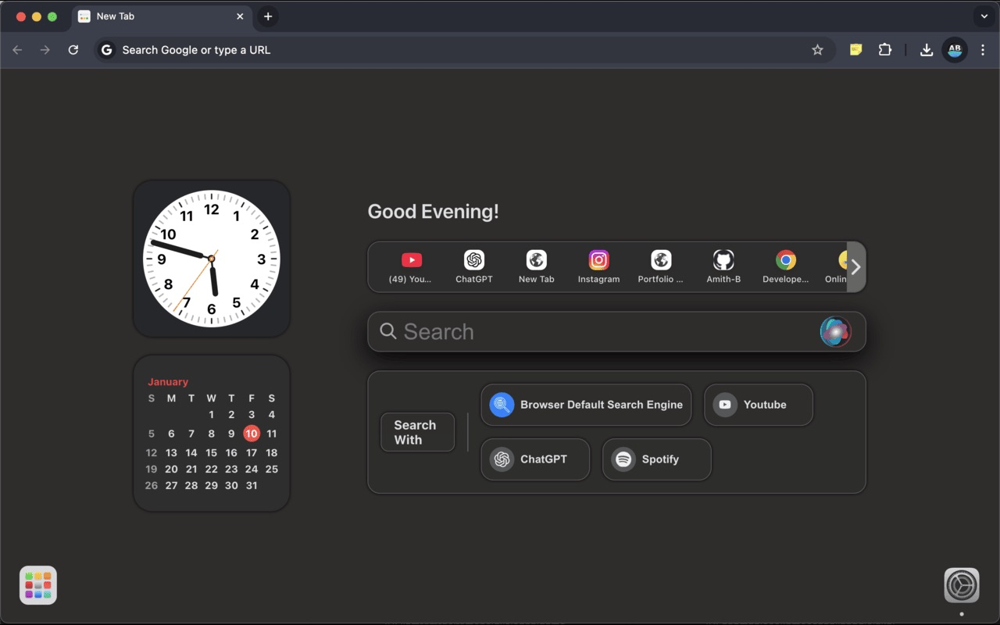
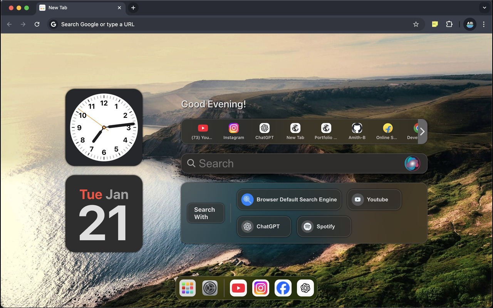

# macOS Inspired New Tab

This is a simple new tab (browser's home page) inspired by macOS design, created using React.

<p align="center">
   
  
</p>
<p align="center">
   
  
</p>
<p align="center">
   
  
</p>

## 🚀 Features

### 🌟 Elegant Widgets
- Display an **analog clock**, **date**, and **personalized greetings**—just like macOS.

### 🔍 Powerful Search
- Search effortlessly with an intuitive input bar.
- Choose between:
  - Your **browser’s default search engine**
  - **YouTube**
  - **ChatGPT**
  - **Spotify**
- If a URL is detected, it directly redirects instead of searching (browser search only).

### ⚡ Quick Access to Favorites
- Navigate to your most-visited sites quickly.
- Customize whether links open in the same tab or a new one.

### 🎨 Customizable Themes & Wallpapers
- Toggle between **dark mode, light mode, or system mode**.
- Choose theme colors.
- Set a **custom wallpaper** or pick from a **stunning collection**.

### 📅 Toggle Calendar Views
- Switch between **month view** and **date view**.

### 🗣️ Voice Search
- Activate voice search with a Siri-like button for hands-free browsing.

### 📱 Launchpad & Dock
- Access favorite links quickly with a customizable **dock bar** and **Launchpad overlay**.

### 🌍 Multi-Language Support
- Supports **15+ languages**, including English, Kannada, Hindi, Spanish, French, and more.

## 🛠 Installation & Running Locally

### Install Packages
```sh
yarn install
```

### To Run the Project
```sh
yarn start
```

### To Build
```sh
yarn build
```

#### Once the build is generated in the `build` folder, this folder can be used to load the extension in `chrome://extensions/` with Developer Mode enabled.

## Chrome Extension Link
[Install from Chrome Web Store](https://chromewebstore.google.com/detail/mac-new-tab/mohppegbiigoahehdihbgmabkflajklj?authuser=0&hl=en)

---

Enjoy the elegance of macOS design right in your browser! ✨

